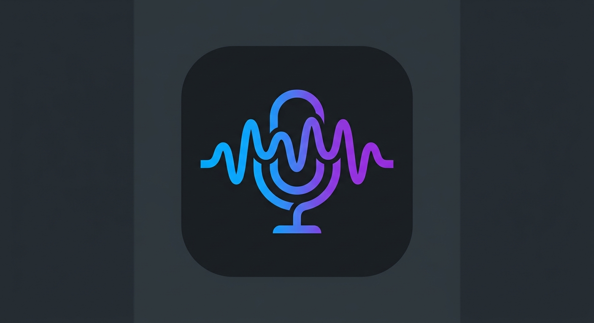

<div align="center">
  
  <h1>Auditext Studio 🎙️</h1>
  <p><strong>The Ultimate Open-Source Text-to-Speech Generation Engine for Android.</strong></p>

  <p>
    <a href="#features">Features</a> •
    <a href="#how-it-works">How it Works</a> •
    <a href="#tech-stack">Tech Stack</a> •
    <a href="#installation">Installation</a> 
  </p>
</div>

---

## ⚡ What is Auditext?

**Auditext** is a professional-grade Text-to-Speech (TTS) studio built for modern creators. Why limit yourself to one AI model? Auditext acts as a unified hub allowing you to dynamically generate hyper-realistic audio using your favorite AI providers—all wrapped in a sleek, offline-first Android interface.

Whether you're developing audiobooks, narrating videos, crafting podcasts, or studying languages, Auditext hands you the director's chair.

---

## 🔥 Key Features

*   **🎭 Multi-Provider Support:** Switch seamlessly between **Native (Offline)**, **Gemini**, **OpenAI**, **ElevenLabs**, **Deepgram**, and **Cartesia**.
*   **🧠 Emotional Intelligence:** Pre-built emotion profiles (Happy, Sad, Angry, Whispering) that automatically adjust baseline playback speed and tone for organic delivery.
*   **🎛️ Precision Controls:** Real-time speed tuning sliders and voice profile selection.
*   **📚 Local Session History:** Never lose a generation. Every prompt, voice, and setting is backed up locally using a persistent Room SQLite database.
*   **🔒 Secure API Management:** Encrypted DataStore preferences allow you to bring your own API keys (BYOK) for third-party integrations safely.
*   **🎨 "Charcoal Studio" UI:** A deeply refined, distraction-free aesthetic built entirely in Jetpack Compose Material 3.

---

## 🛠️ Tech Stack

Auditext is built with modern, production-ready Android components:

*   **Language:** Kotlin
*   **UI Framework:** Jetpack Compose (Material 3)
*   **Architecture:** Clean MVVM (Model-View-ViewModel) + StateFlow
*   **Local Storage:** Room Database (Offline History), DataStore Preferences (Secure Settings)
*   **Async/Concurrency:** Kotlin Coroutines & Flow
*   **Audio Engine:** Centralized `TtsManager` scaling to HTTP buffers.

---

## 🚀 Getting Started

### Prerequisites
*   Android Studio Ladybug (or newer)
*   Java Development Kit (JDK) 17+

### Installation & Run

1.  **Clone the repository:**
    ```bash
    git clone https://github.com/your-username/auditext.git
    cd auditext
    ```

2.  **Open in Android Studio:**
    Open the project in Android Studio and let Gradle sync.

3.  **Run the App:**
    Connect your Android device or start an emulator and hit **Run** (`Shift + F10`).

---

## 🔑 AI Provider Setup (BYOK)
Auditext uses a Bring-Your-Own-Key model. 
1. Open the app and tap the **⚙️ Settings** icon.
2. Select your desired AI provider from the dropdown.
3. Paste your API Key and tap **Save**.
*Note: If no API key is provided, the engine gracefully falls back to the high-performance Native Offline TTS.*

---

## 🤝 Contributing
Want to add a new AI Provider? Fix a UI glitch? PRs are absolutely welcome! 
1. Fork the Project
2. Create your Feature Branch (`git checkout -b feature/AmazingVoiceEngine`)
3. Commit your Changes (`git commit -m 'Add some AmazingVoiceEngine'`)
4. Push to the Branch (`git push origin feature/AmazingVoiceEngine`)
5. Open a Pull Request

---

<div align="center">
  <i>If you find Auditext helpful, <b>leave a ⭐ on this repository!</b></i>
</div>
